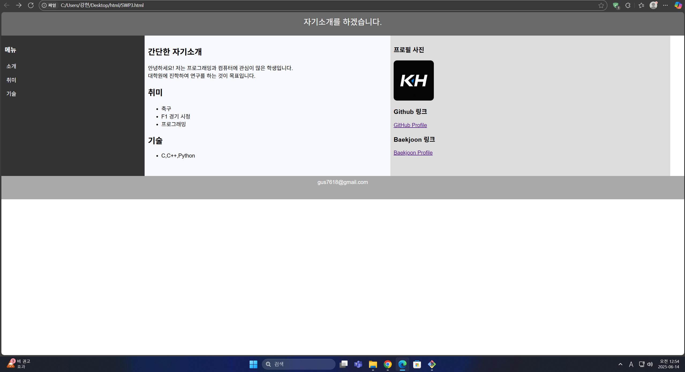
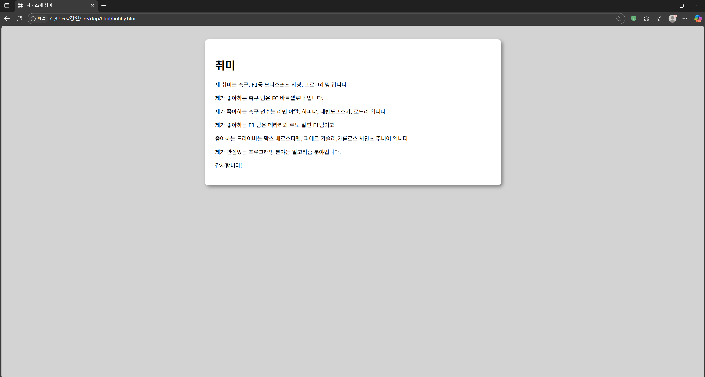

# 소프트웨어 프로젝트 3 – 자기소개 페이지

## 작성자
- **이름:** 강현  
- **학번:** 202168052

## 주제
**자기소개 페이지 구현**

---

## 구성 요소
- 페이지 내 이동 링크 (`소개`, `취미`, `기술`)
- 프로필 사진
- GitHub 외부 링크
- HTML/CSS 기반의 레이아웃 구성

---

## 🛠 사용 기술
- `HTML5`
- `CSS3`
  - 박스(box) 레이아웃 구성
  - 색상 지정 및 시각적 스타일링

---

## 화면 예시
메뉴 및 자기소개 화면:

---
## 화면 예시 2
메뉴 각 항목 클릭 후 출력 화면(여기선 취미 클릭)

---

## 느낀 점
웹 개발의 기초적인 부분을 어느 정도 체험험해볼 수 있었고,  
기회가 된다면 좀 더 다듬어서 실제 사용되는 웹페이지처럼  
**퀄리티를 향상**시켜보고 싶다.

---

## 링크
- [GitHub 프로필 바로가기](https://github.com/kang01hyoun)
